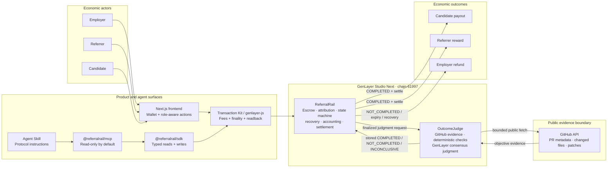
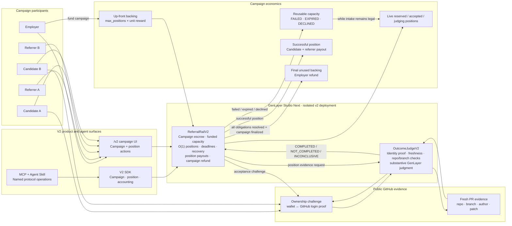
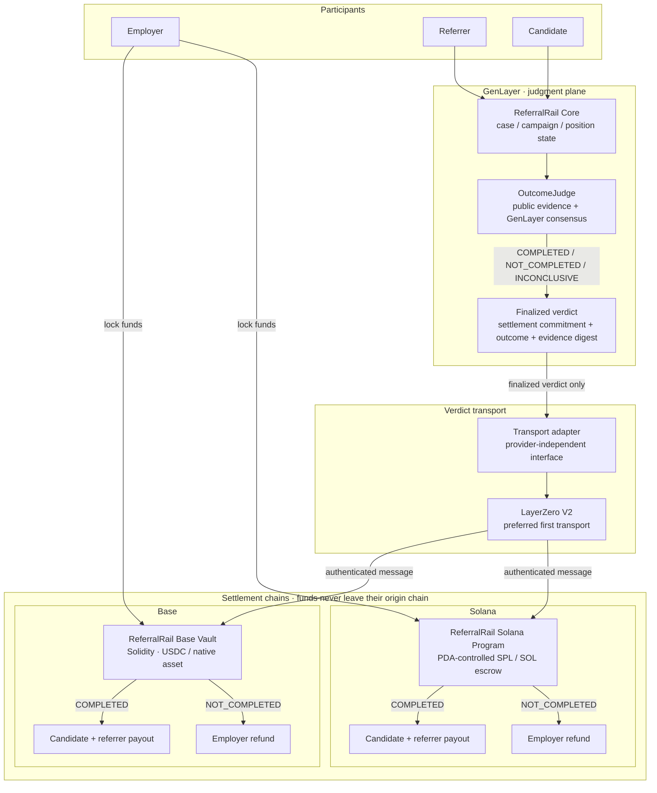

<p align="center">
  
</p>

# ReferralRail

**Referral attribution becomes enforceable economic state.**

ReferralRail is a GenLayer Future of Work protocol for one narrow lifecycle: an employer pre-funds a paid opportunity, a third-party referrer binds the nominated candidate, the candidate explicitly accepts that attribution before completing the job, GenLayer independently verifies the finished public work, and a successful result splits the committed funding between candidate and referrer.

ReferralRail is deliberately **not** a freelance marketplace, generic bounty board, generic escrow, dispute court, reputation system, or prediction market. The protocol exists to make a referral relationship and its later economic consequence explicit, accepted, immutable and auditable before the outcome is known.

## Hackathon target

- Track: **Future of Work**
- Network: **Studio Next / Studionet Dev**
- Chain ID: **61997**
- RPC: `https://studio-dev.genlayer.com/api`
- Explorer: `https://explorer-studio-dev.genlayer.com/`
- Contracts: exactly two Intelligent Contracts
- Backend: none
- Evidence source: public GitHub API only

The repository intentionally hard-locks the frontend and deployment tooling to this network configuration.

## Current architecture · v1

V1 keeps the trust boundary deliberately small. The browser, SDK and MCP surfaces all resolve to the same two-contract protocol on GenLayer. There is no application backend or private database between the user and the protocol state.



The architecture has three deliberate separations:

- **coordination state** lives in `ReferralRail`, including escrow, accepted attribution, deadlines and settlement truth;
- **substantive work judgment** lives in `OutcomeJudge`, which independently refetches public GitHub evidence under GenLayer consensus;
- **interfaces never become authorities**: the frontend, SDK, MCP server and Agent Skill can request actions and display finalized state, but none can invent a judgment or bypass the contracts.

## Product lifecycle

1. **Employer funds opportunity.** The immutable brief, acceptance criteria, GitHub repository, candidate wallet, candidate payment, referral reward, and deadlines are written on-chain. The call must carry exactly `candidate payment + referral reward`.
2. **Referrer locks attribution.** A third-party referrer names the already-registered candidate. Employer and candidate cannot self-refer; an existing referral cannot be replaced.
3. **Candidate accepts.** Only the candidate may accept and bind their GitHub login. This is the point at which referral attribution becomes accepted protocol state.
4. **Candidate submits completed work.** The candidate supplies only a PR number. The repository source was frozen at opportunity creation, preventing arbitrary evidence URLs.
5. **OutcomeJudge verifies.** Objective GitHub facts are checked first, then the actual merged change is evaluated against the frozen natural-language criteria. Validators independently refetch and independently re-run the substantive judgment.
6. **Settlement.** `COMPLETED` pays candidate + referrer; `NOT_COMPLETED` refunds the employer; `INCONCLUSIVE` enters a bounded cure route. Stale or exhausted cases can always recover funds.

Terminal opportunity states are `PAID`, `REFUNDED`, `EXPIRED`, or `CANCELLED`.

## ReferralRail v2 — in development

The deployed product on `main` is ReferralRail v1. A broader multi-position protocol is being built separately on the [`referralrail-v2`](https://github.com/ometere123/referralrail/tree/referralrail-v2) branch. V2 is intentionally isolated from v1: it uses separate contracts, separate deployment records and separate `/v2` product routes, and it is **not** the production protocol served by the current v1 deployment.

V2 changes the unit of coordination from **one funded opportunity for one nominated candidate** to **one fully funded campaign with multiple independently judged referral positions**.

### V2 architecture

V2 preserves the same two-contract trust model, but moves escrow and accounting up to the campaign level while each referral becomes an independently tracked position. Successful positions consume the campaign target; failed or expired positions can release capacity for replacement participation while that capacity is still legally reusable.



The important V2 distinction is that **success capacity and unresolved occupancy are different concepts**. A paid success permanently counts toward the campaign target without remaining an unresolved position, while failed/expired/declined positions may free backing for another participant. Campaign closure therefore depends on resolved economic obligations, not simply on whether a position ever existed.

### Campaigns and funded capacity

- An employer creates a campaign with a fixed successful-position target.
- Campaign funding is reserved up front as `max_positions × (candidate_reward + referral_reward)`.
- Campaign terms, repository, base branch, evidence criteria, timing and rewards are immutable once active.
- Every advertised successful position is therefore economically backed before participation begins.
- Campaign accounting separates available backing, live obligations, payable outcomes, paid value, refundable value and already-refunded value so conservation can be checked explicitly.

### Referral reservations and reusable capacity

- Referrers reserve positions for nominated candidates rather than permanently consuming a slot at referral time.
- The nominated candidate must personally accept before doing the work.
- Reservations have bounded acceptance deadlines and can expire or be released.
- `FAILED`, `EXPIRED` and `DECLINED` positions release capacity when replacement participation is still legal.
- A terminal failed candidate does not automatically return reusable campaign capital to the employer; the backing can fund a replacement candidate while intake is still open.
- A successful position consumes one successful target permanently, but a settled `PAID` position no longer remains an unresolved active obligation.

V2 position states are currently modelled as `RESERVED`, `ACCEPTED`, `JUDGING`, `INCONCLUSIVE`, `COMPLETED`, `PAID`, `FAILED`, `EXPIRED` and `DECLINED`. Campaign-level states distinguish active intake, resolution and terminal closure.

### Stronger GitHub identity and evidence binding

Candidate identity becomes part of the evidence protocol rather than a free-form username field. Acceptance creates a unique GitHub ownership challenge bound to the campaign, position and candidate wallet. The candidate must publish the exact challenge from the GitHub account they claimed. The judge then verifies the frozen repository, candidate login, base branch, freshness window and ownership proof before substantive evaluation.

A qualifying pull request is expected to be fresh relative to the accepted position, which prevents old public work from being replayed as new campaign work. Evidence is also tied to the exact position/attempt so the same successful work cannot silently settle multiple obligations.

### OutcomeJudgeV2 and three-way judgment

`OutcomeJudgeV2` independently fetches bounded public GitHub evidence and evaluates objective facts before GenLayer validators assess whether the frozen work requirements were materially satisfied. The closed outcomes remain:

- `COMPLETED`
- `NOT_COMPLETED`
- `INCONCLUSIVE`

Fetch failures, unsafe parsing and genuinely unreliable evidence remain `INCONCLUSIVE`; neither the frontend, SDK, MCP server nor an external AI agent can substitute its own opinion for the finalized judge record.

### Retries, deadlines and permissionless recovery

V2 separates several clocks instead of treating a campaign as one deadline: reservation acceptance, candidate work, campaign participation, judgment timeout and inconclusive cure/retry. Reservations and accepted work expire at bounded deadlines. Judgment stalls have bounded recovery. Inconclusive outcomes have a bounded retry window and attempt count rather than an infinite retry loop.

`recover_position` is designed to be permissionless once the relevant timeout or cure condition is objectively satisfied, so a missing employer, referrer or candidate cannot permanently lock campaign escrow.

### Settlement and campaign closure

A finalized `COMPLETED` judgment creates a payable position, but judgment and actual fund release remain separate facts. Candidate and referrer payout legs are tracked explicitly and a position becomes `PAID` only after the required value has been released.

Unused campaign backing is not refundable while it is still supporting live or potentially payable positions. Intake can close while existing participants continue resolving. Final campaign refund is permitted only after the remaining economic obligations are resolved and the unused backing can be calculated deterministically.

### V2 product and integration surfaces

The v2 branch is also expanding the human and agent interfaces together:

- dedicated campaign routes at `/v2`, `/v2/campaigns/new` and `/v2/campaigns/[id]`;
- typed v2 SDK reads/writes for campaigns, positions, accounting and lifecycle actions;
- MCP tools that expose named ReferralRail operations while remaining read-only by default unless writes are explicitly enabled;
- an updated Agent Skill that teaches campaign capacity, retries, settlement and recovery without allowing the agent to replace GenLayer judgment;
- dedicated v2 architecture, state-machine, security, accounting, identity-proof, judgment, recovery, testing, deployment and live-evidence documentation.

### Current v2 status

V2 remains **work in progress** and should not be treated as the live production protocol yet. The branch already contains the campaign architecture, fresh v2 contracts, v2 frontend routes, typed SDK work, model/static tests and a dedicated documentation set, but final live lifecycle evidence, complete integration audit and final readiness verification are still being completed. The source of truth for current progress is [`docs/v2/BUILD_STATUS.md`](https://github.com/ometere123/referralrail/blob/referralrail-v2/docs/v2/BUILD_STATUS.md).

Until that work is complete and deliberately promoted, **v1 on `main` remains the canonical deployed ReferralRail product**.


## ReferralRail v3 — cross-chain settlement design

V3 extends ReferralRail from a GenLayer-native escrow protocol into a **chain-agnostic judgment and settlement protocol**. The economic principle is simple: **funds stay on the chain where they were deposited; only the finalized ReferralRail verdict crosses chains**.

An employer could lock USDC or a native asset on Base, Solana or another supported settlement chain. GenLayer still performs the evidence evaluation and reaches the canonical `COMPLETED`, `NOT_COMPLETED` or `INCONCLUSIVE` judgment. After GenLayer finality, a compact authenticated verdict is delivered to the settlement chain, where the local vault either pays candidate + referrer or refunds the employer.

V3 is a design direction, not part of the current v1 deployment or the isolated v2 branch.

### V3 architecture



The money does **not** bridge through GenLayer. Base escrow stays on Base; Solana escrow stays on Solana. Cross-chain transport carries resolution data, not principal.

### Transport choice: LayerZero V2 first

The preferred first V3 transport is **LayerZero V2**, not Hyperlane.

That choice is pragmatic:

- the GenLayer Foundation already maintains a cross-chain bridge boilerplate built around LayerZero and describes the same hub-and-spoke pattern: a source-chain application sends work to GenLayer, GenLayer reaches consensus, and the result is returned to the source chain;
- GenLayer Foundation's Internet Court architecture also uses LayerZero V2 between Base escrow and GenLayer judgment;
- LayerZero V2 has deployed infrastructure on Base and a dedicated Solana OApp stack, so both initial settlement targets fit the same transport family;
- ReferralRail only needs general message passing for a compact verdict payload. It does **not** need a token bridge because the escrowed assets remain local.

Hyperlane remains a credible future transport because it supports arbitrary message passing, permissionless chain expansion and Solana/SVM connectivity. V3 should therefore keep transport behind a small adapter rather than make economic state depend permanently on one bridge provider.

### Settlement commitment

Before work starts, the destination vault computes and freezes a settlement commitment covering the facts that must never change after judgment begins:

```text
protocol_version
settlement_chain / domain
vault or program address
escrow / position id
asset
employer
candidate
referrer
candidate reward
referral reward
```

The same commitment is registered in the GenLayer case. The judge does not instruct a remote chain to arbitrary-send money to addresses supplied after the fact; it resolves the already-bound obligation.

A final message should be closer to:

```text
verdict_id
case / campaign / position id
attempt id
settlement domain
settlement commitment
COMPLETED | NOT_COMPLETED | INCONCLUSIVE
evidence digest
```

than to a generic "pay this address" command.

### Destination-chain safety

Every Base vault or Solana program must independently enforce the settlement boundary:

- accept messages only from the configured ReferralRail origin and authenticated transport path;
- require the exact frozen settlement commitment;
- bind the verdict to one case/position and one attempt;
- reject a verdict addressed to another chain, vault or escrow;
- consume each `verdict_id` exactly once;
- make settlement idempotent so duplicate delivery cannot duplicate payout;
- keep judgment and fund release as separate observable facts;
- allow safe re-delivery of the same finalized verdict if transport delivery stalls, without allowing a relayer or frontend to invent a replacement outcome.

`INCONCLUSIVE` must never release either side's money as if a final economic outcome had been reached. Its retry/recovery rules remain part of GenLayer protocol state.

### Base settlement

On Base, a Solidity `ReferralRailVault` holds the chosen asset under an escrow id. The vault knows the immutable settlement commitment before the ReferralRail case is judged. Once its LayerZero receiver verifies a finalized verdict:

- `COMPLETED` releases the configured candidate reward and referral reward;
- `NOT_COMPLETED` refunds the configured employer;
- an already-consumed verdict cannot settle again.

The vault does not inspect GitHub, call an LLM or decide whether the work was good. It only authenticates a GenLayer resolution and executes the pre-funded obligation.

### Solana settlement

On Solana, the equivalent component is a ReferralRail program using PDAs for escrow and settlement state. SPL assets such as USDC can remain in program-controlled token accounts, while native SOL can use the corresponding program-owned escrow path.

LayerZero's Solana OApp model uses a PDA as the application identity and explicit `lz_receive` account discovery. ReferralRail's Solana receiver would verify the trusted GenLayer pathway, resolve the settlement PDA and consumed-verdict state, then perform the already-bound token transfers.

Again, the Solana program does no substantive judging.

### GenLayer finality boundary

The verdict is not eligible for cross-chain delivery merely because the user submitted a transaction or an initial committee accepted it. V3 must export only a **finalized** ReferralRail outcome.

GenLayer's production architecture supports external messages from an Intelligent Contract back to the GenLayer Chain EVM layer only on finalization. In Studio, EVM contract calls beyond EOA value transfers are not currently implemented, so an early V3 prototype should use the GenLayer Foundation bridge-service pattern to observe finalized state and relay the authenticated payload. That development relay is transport infrastructure, not a judgment authority.

### V3 invariant

The intended separation is:

**GenLayer resolves the obligation. The settlement chain executes it.**

This keeps GenLayer as the judgment plane, Base/Solana as the asset plane, and the interoperability layer as a replaceable transport plane. The design scales naturally to additional chains without moving ReferralRail's escrow principal through GenLayer or forcing all users into one settlement asset.

## Why GenLayer is essential

The three economic actors have conflicting incentives. An employer should not be able to erase a referrer after useful work is delivered; a referrer should not be able to silently bind a candidate; and a candidate should not be able to self-certify completion. Whether a merged change materially satisfies an immutable natural-language work specification is consequential judgment that moves pre-funded value. ReferralRail puts that judgment inside GenLayer consensus rather than a private employer database or centralized reviewer.

The protocol deliberately separates deterministic facts from judgment:

- deterministic: repository identity, PR author, merged state, merge deadline, exact funding, actor authorization, replay protection;
- consensus judgment: whether the readable merged diff materially satisfies every mandatory acceptance criterion;
- safe uncertainty: missing, malformed, truncated or unavailable evidence becomes `INCONCLUSIVE`, not an invented approval or rejection.

## Contracts

### `contracts/referral_rail.py`

The settlement/state contract owns funding, attribution, candidate acceptance, the state machine, immutable economic terms, settlement, refund/expiry/recovery, replay protection and accounting invariants. It can accept outcome callbacks only from the one configured judge and only for the exact active opportunity/attempt.

### `contracts/outcome_judge.py`

The source-restricted judge fetches only the GitHub PR and changed-file API paths derived from the repository already frozen in the settlement contract. It stores an evidence digest and audit summary. Its validator does not merely validate JSON: it independently refetches GitHub and independently repeats the meaningful evaluation before comparing the outcome and stable evidence fields.

Contract-to-contract writes use finalized messages so appealed parent executions cannot create irreversible duplicate economic actions.

## Frontend

The Next.js frontend makes the protocol lifecycle visible rather than hiding it behind a generic dashboard. It has a distinct referral/payment visual language, a public live opportunity board, employer creation flow, candidate/referrer role actions, judgment evidence, terminal settlement display and responsive layouts.

Transaction UX distinguishes wallet/network readiness, signature, submission, consensus, finalization and contract readback. A write is not labelled successful merely because the wallet submitted it: the UI tracks to finalization and then checks finalized contract state.

## Repository map

```text
contracts/                 two Intelligent Contracts
frontend/                  Next.js product UI + Transaction Kit RC2
deploy/                    fee-aware two-contract deployment script
deployment/                generated live manifest/evidence destination
docs/                      architecture, security, validation, state machine, demo and review traceability
tests/model/               executable state/accounting model tests
tests/static/              contract architecture and safety assertions
scripts/                   preflight and live-evidence helpers
SUBMISSION.md               Portal-ready submission copy
AGENT_HANDOFF.md            exact remaining live execution procedure
```

## Local verification

The environment used to create this repository had no external package registry or GenVM runtime, so the checks that were genuinely executable here are recorded in `docs/TEST_REPORT.md`. Run the full release gate in a networked development environment before submission:

```bash
python -m pip install -r requirements.txt
npm install
python -m pytest -q
genvm-lint check contracts/referral_rail.py
genvm-lint check contracts/outcome_judge.py
npm run typecheck
npm run build
python scripts/preflight.py
```

The pure-Python protocol/invariant suite contains 27 passing tests. GenVM lint and
Direct Mode add 4 passing tests; the live Studio Next deployment/binding smoke test
also passes. The frontend TypeScript check and production build pass.

## Deployment

`deploy/001_deploy_referralrail.ts` refuses the wrong chain/RPC, obtains a fresh live
fee quote, deploys ReferralRail, deploys OutcomeJudge with the settlement address,
binds the judge exactly once, waits for finalization, verifies execution success and
writes `deployment/61997.json` from real receipts/readback.

Follow `docs/DEPLOYMENT.md` and `AGENT_HANDOFF.md`. No deployment address or transaction hash is hard-coded or fabricated in this repository.

## Demo

The intended 90–120 second story is:

**Employer funds → referrer refers → candidate accepts → candidate submits merged PR → GenLayer verifies → candidate is paid → referrer visibly earns because their accepted referral completed.**

See `docs/DEMO_SCRIPT.md`.

## Submission status

The contracts are deployed and the frontend is configured locally for the real 61997
addresses. The remaining release evidence is the full three-wallet lifecycle,
negative/inconclusive live case, hosted frontend smoke test, and mandatory demo.
GLSim multi-validator testing remains blocked by the native Windows runner defect.